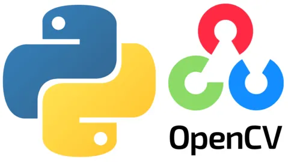

# 🧠 OpenCV Python Basics — Hands-On Computer Vision



**OpenCV | Computer Vision | Image Processing | Face Detection | Python Portfolio Project**

This repository showcases my hands-on learning of **OpenCV (cv2) in Python**, demonstrating practical computer vision skills used in real-world **data science, machine learning, and AI pipelines**.

The work is based on the tutorial *OpenCV Python Tutorial for Beginners* (YouTube: x7n85SJMjUA) and extended with structured, well-documented exercises, including **face detection**.

👉 **GitHub Repo:** https://github.com/helsharif/opencv-python-basics

---

## 🎯 Project Objective

The goal of this project is to demonstrate my ability to:
- Work with image data using OpenCV and NumPy
- Apply core computer vision preprocessing techniques
- Detect edges, shapes, and faces in images
- Prepare visual data for downstream ML / AI pipelines
- Structure computer vision experiments in clean, readable notebooks

This aligns strongly with roles requiring:
- **Computer Vision**
- **Machine Learning Engineering**
- **Medical Imaging / Healthcare AI**
- **Remote Sensing & Geospatial Analytics**
- **Applied Data Science with visual data**

---

## 🧰 Tech Stack

- **Python 3.x**
- **OpenCV (cv2)**
- **NumPy**
- **Matplotlib**
- **Jupyter Notebook**
- Haar Cascade Classifiers (for face detection)

---

## 📂 Repository Structure

```
opencv-python-basics/
├── example_images/          # Sample images used in exercises
├── e01_opencv_basics.ipynb  # Main Jupyter Notebook with all exercises
├── .gitignore
├── README.md
```

---

## 📘 Topics & Exercises Covered

The notebook walks through the following core OpenCV concepts:

### 1️⃣ Image Loading & Display
- `cv2.imread()`
- `cv2.imshow()`
- Understanding BGR vs RGB color formats

### 2️⃣ Color Space Conversion
- `cv2.cvtColor()`
- BGR → Grayscale
- BGR → RGB

### 3️⃣ Image Resizing & Scaling
- `cv2.resize()`
- Aspect ratio handling

### 4️⃣ Blurring & Smoothing
- Gaussian blur
- Noise reduction techniques

### 5️⃣ Edge Detection
- Canny edge detector
- Visualizing object boundaries

### 6️⃣ Thresholding
- Binary thresholding
- Pixel intensity segmentation

### 7️⃣ Drawing & Annotation
- Lines, rectangles, circles
- Overlaying shapes on images

### 8️⃣ Text Overlay
- `cv2.putText()`
- Adding labels directly on images

### 9️⃣ Face Detection (Haar Cascades)
- Loading pre-trained Haar cascade classifiers
- Detecting faces in images
- Drawing bounding boxes around detected faces
- Practical example of classical CV object detection

---

## 🔍 Why This Matters for Data Science & ML

OpenCV is a foundational layer in many production AI systems, including:

- **Medical imaging** (e.g., retinal scans, X-rays, MRI preprocessing)
- **Remote sensing & satellite imagery**
- **Autonomous systems**
- **Manufacturing quality inspection**
- **Document processing & OCR pipelines**

This project reflects my ability to:
- Handle raw visual data
- Build preprocessing pipelines for ML models
- Combine classical CV with modern deep learning workflows
- Treat images as first-class data objects in Python

---

## ▶️ How to Run

1. **Clone the repository**
```bash
git clone https://github.com/helsharif/opencv-python-basics.git
cd opencv-python-basics
```

2. **Install dependencies**
```bash
pip install opencv-python numpy matplotlib jupyter
```

3. **Launch Jupyter**
```bash
jupyter notebook
```

4. **Open the notebook**
```
e01_opencv_basics.ipynb
```

---

## 🧠 Learning Outcomes

Through this project, I strengthened my ability to:

- Use OpenCV APIs for image I/O and manipulation
- Convert between color spaces correctly
- Apply filtering and edge detection techniques
- Perform classical face detection using Haar cascades
- Annotate and visualize images for analysis
- Integrate visual preprocessing into ML pipelines

---

## 📌 Next Steps (Planned Enhancements)

- Feature detection (ORB, SIFT)
- Image segmentation
- Real-time webcam processing
- Integration with deep learning models (TensorFlow / PyTorch)
- Object detection with modern DL models (YOLO, SSD)

---

## 🤝 Let’s Connect

If you'd like to discuss:
**Computer Vision • OpenCV • Medical Imaging • AI/ML • Data Science • Geospatial Analytics**

Feel free to connect via **LinkedIn** https://www.linkedin.com/in/husayn-el-sharif/ or explore my other projects on **GitHub** https://github.com/helsharif.

---

⭐ If you found this project useful, feel free to ⭐ the repo!
